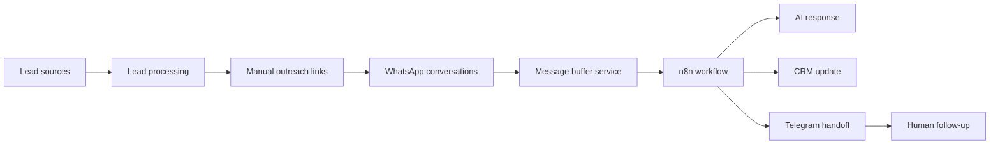

# Autobots

Autobots is an automation agency codebase for WhatsApp lead filtering, CRM organization, and human handoff systems for local businesses in Paraguay.

The project started from useful legacy code: a Google Maps lead generation pipeline and a previous WhatsApp/n8n automation. The current goal is to turn that context into a cleaner, repeatable Automation as a Service system.

## Core idea

The core product is a WhatsApp Lead Filter + CRM + Telegram/WhatsApp Human Handoff system.

It should help a business:

- answer repetitive WhatsApp questions faster
- qualify leads with useful questions
- save lead data in a simple CRM
- notify the owner or salesperson when a lead is worth follow-up
- keep humans in control of closing conversations

## System Map




## Repository Layout

- `src/autobots/scrapers/` - Google Maps and lead discovery tools
- `src/autobots/leads/` - lead scoring and pipeline scripts
- `src/autobots/outreach/` - manual outreach helpers, including WhatsApp links
- `src/autobots/dashboard/` - preserved local Flask dashboard
- `src/autobots/config/` - non-secret scraper settings and search config
- `src/autobots/services/message_buffer/` - FastAPI service that buffers WhatsApp message fragments before n8n
- `src/autobots/handoff/` - local helpers for formatting human handoff alerts
- `n8n/workflows/` - reusable n8n workflow exports from the previous WhatsApp automation
- `docs/context/` - legacy technical context and implementation notes
- `data/legacy/` - preserved legacy scraped dataset
- `data/raw/` and `data/processed/` - local generated outputs

## Setup

```bash
python3 -m venv .venv
source .venv/bin/activate
pip install -r requirements.txt
python -m playwright install chromium
cp .env.example .env
```

Run the legacy lead pipeline:

```bash
PYTHONPATH=src python -m autobots.leads.pipeline
```

Run the legacy dashboard:

```bash
PYTHONPATH=src python -m autobots.dashboard.app
```

Generate manual WhatsApp links from a JSON lead export:

```bash
PYTHONPATH=src python -m autobots.outreach.message_generator
```

Run the WhatsApp message buffer service locally:

```bash
PYTHONPATH=src uvicorn autobots.services.message_buffer.app:app --host 0.0.0.0 --port 8081 --reload
```

The buffer service receives Evolution API webhook events at:

```text
POST /webhook/evolution
```

It stores short WhatsApp message fragments in Redis, waits for `MESSAGE_BUFFER_SECONDS`, combines messages from the same sender, and forwards one payload to `N8N_WEBHOOK_URL`. It does not send WhatsApp replies directly.

Required local variables:

```bash
REDIS_URL=redis://localhost:6379/0
N8N_WEBHOOK_URL=http://localhost:5678/webhook/whatsapp-buffer
MESSAGE_BUFFER_SECONDS=8
```

Docker local deployment notes live in `docs/deployment/docker-local.md`.

## Development Boundaries

This repository prepares, routes, buffers, and documents automation flows. It does not send outbound WhatsApp campaigns from Python code.

Safe actions in this repo:

- generate manual WhatsApp links
- inspect leads locally
- buffer inbound WhatsApp messages
- forward combined inbound messages to n8n
- format human handoff alerts

Actions that need explicit production review:

- sending WhatsApp replies
- importing n8n workflows into a live account
- connecting real Telegram, Notion, AI, or Evolution credentials
- processing real customer data

## Reusable Legacy Context

The repo preserves previous work in two groups:

- Google Maps scraping and sales pipeline logic from the old lead generation project.
- n8n, Evolution API, Telegram, Notion, and AI workflow context from the previous WhatsApp responder project.


## AI tools that helped me do this project

- Codex 5.5 extended thinking (almost all the time)
- Claude Sonnet 4.7
