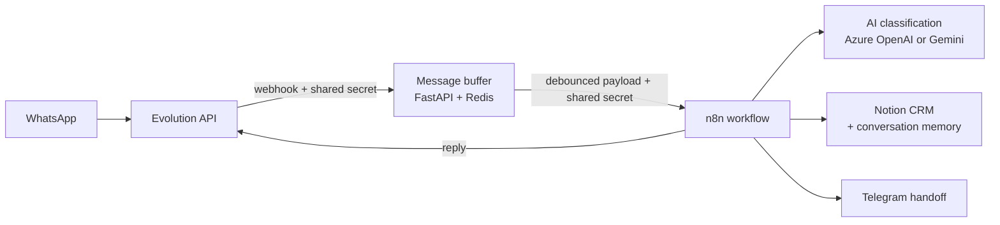

# Autobots

[](https://github.com/nicolasvargaszz/autobots/actions/workflows/ci.yml)

WhatsApp lead qualification for small businesses in Paraguay: an AI agent answers repetitive questions, qualifies the lead, saves it to a CRM, and hands the conversation to a human the moment it matters.

**Agency landing page:** [nicolasvargaszz.github.io/autobots](https://nicolasvargaszz.github.io/autobots/)

Built as the delivery system for a real automation service (fixed-scope packages, setup fee + monthly maintenance), not as a demo. Everything here deploys to a $12/month droplet and runs on GitHub Student Pack credits.

## The problem

Small businesses in Paraguay live on WhatsApp. Inquiries arrive fragmented ("Hola" … "tienen taladros?" … "precio?"), get answered hours late or not at all, and nobody knows which conversations were worth following up. Hiring someone to watch the phone all day costs more than the leads being lost.

## What the system does

1. A customer writes to the business WhatsApp number.
2. Message fragments are buffered and combined into one coherent message (people send 4 short messages, not 1 long one).
3. An AI model classifies intent (interested / needs info / wants meeting / spam) and extracts CRM memory: business type, pain point, budget, requested time.
4. The lead is created or updated in Notion with conversation memory.
5. A reply is generated in natural Paraguayan Spanish, validated against recent bot messages so it never repeats itself, and sent back through WhatsApp.
6. When the lead is hot (wants a meeting, price discussion, asks for a human), the owner gets a Telegram alert with full context and takes over. Humans close; the bot filters.

## Architecture


```mermaid
flowchart LR
    A[WhatsApp] --> B[Evolution API]
    B -- webhook + shared secret --> C[Message buffer<br/>FastAPI + Redis]
    C -- debounced payload + shared secret --> D[n8n workflow]
    D --> E[AI classification<br/>Azure OpenAI or Gemini]
    D --> F[Notion CRM<br/>+ conversation memory]
    D --> G[Telegram handoff]
    D -- reply --> B
```

Two custom pieces do the work n8n cannot do well alone:

- **Message buffer service** (`src/autobots/services/message_buffer/`) — FastAPI + Redis. Debounces WhatsApp message fragments per sender (8s quiet window), deduplicates webhook retries, optionally transcribes voice notes (Whisper via OpenAI or Azure), and forwards one combined payload to n8n. When n8n is down, payloads are parked in a dead-letter queue and redelivered automatically with bounded exponential backoff — no message is lost.
- **n8n workflow templates** (`n8n/workflows/`) — the flagship buffered-inbound workflow (intent classification, Notion memory upsert, anti-repetition reply validation, Telegram handoff), plus an error-alert workflow and a WhatsApp session monitor. All templates are sanitized: every secret and ID comes from environment variables.

AI calls are provider-agnostic: `AI_PROVIDER=azure` uses Azure OpenAI (Student Pack credits), `AI_PROVIDER=gemini` uses the Gemini free tier. Switching is a `.env` change; request building and response parsing handle both shapes.

## Security decisions

- Both webhook hops (Evolution → buffer, buffer → n8n) require an `X-Autobots-Webhook-Secret` header; the buffer refuses to accept traffic when the secret is unset instead of running open.
- API keys travel in headers, never in URLs, so they cannot leak into execution logs.
- `docker compose` fails to start when a required secret is missing (`${VAR:?}`), and no credential is ever hardcoded in code or workflow JSON.
- Production has no public HTTP surface: only SSH is exposed; admin UIs are reached through SSH tunnels (see the [deployment guide](docs/deployment/digitalocean.md)).
- The legacy Flask dashboard requires Basic Auth (constant-time comparison) and binds to `127.0.0.1`.

## Operations

The buffer service is built to be run for paying clients, not just demoed:

- **Dead-letter queue** — undeliverable payloads are retried with exponential backoff (`DLQ_*` settings) and can be inspected, replayed, or discarded through the admin API. A payload that exhausts its retry budget is logged and counted, never silently dropped.
- **Admin API** — `GET /admin/buffers` (sessions waiting in the buffer), `GET /admin/dlq` + `POST /admin/dlq/replay`, and `GET /admin/stats` (per-instance daily counters + hourly histogram). All fail closed behind an `X-Autobots-Admin-Token` header; the endpoints return 503 until `ADMIN_API_TOKEN` is set.
- **Per-client usage metrics** — every instance gets daily counters (messages, combined bursts, voice notes, duplicates, delivery outcomes) and an hourly histogram bucketed in the client's timezone (`STATS_TIMEZONE`).
- **Pilot report** — `python -m autobots.reporting.pilot_report --instance cliente-main --days 7` renders the metrics as a Spanish Markdown report for the day-7 pilot review: messages handled, instant replies, share of inquiries arriving outside business hours, peak hours, and reliability.

## Repository layout

Full map with the reasoning behind every directory: [docs/REPO-MAP.md](docs/REPO-MAP.md). The short version:

- `src/autobots/services/message_buffer/` — the FastAPI buffer service
- `n8n/workflows/` — sanitized n8n workflow templates (`legacy/` holds the superseded PoC); raw live exports stay in the untracked `n8n/exports/`
- `web/` — static landing page (vanilla HTML/CSS, no build step), deployed to GitHub Pages on every push to `main`
- `docs/architecture/` — design notes: buffer + AI flow, conversation memory, error handling, handoff
- `docs/deployment/` — Docker local setup and the DigitalOcean production guide
- `docs/operations/` — the client onboarding runbook (signed pilot → live in one day)
- `docs/legacy/` — preserved docs from the pre-Autobots WhatsApp automation, reference only
- `src/autobots/{scrapers,leads,outreach,dashboard}/` — lead-generation tooling from the project this grew out of (Google Maps/Properstar scraping, lead scoring, manual outreach links)
- `prompts/`, `docs/business/`, `docs/handbook/` — per-niche agent prompts, business strategy, and personal notes, kept local and untracked

## Running it

Local development:

```bash
python3 -m venv .venv && source .venv/bin/activate
pip install -r requirements.txt
cp .env.example .env   # fill in the secrets you need

# tests (buffering, dedup, retries, transcription, security)
PYTHONPATH=src pytest

# buffer service with live reload
PYTHONPATH=src \
REDIS_URL=redis://localhost:6379/0 \
N8N_WEBHOOK_URL=http://localhost:5678/webhook/whatsapp-buffer \
EVOLUTION_BUFFER_WEBHOOK_SECRET=dev-secret \
N8N_BUFFERED_WEBHOOK_SECRET=dev-secret-2 \
uvicorn autobots.services.message_buffer.app:app --host 127.0.0.1 --port 8081 --reload
```

Full stack (Evolution API, Redis, Postgres, n8n, buffer):

```bash
docker compose up -d --build
```

Production deployment on DigitalOcean, end to end (droplet, firewall, secrets, workflow import, WhatsApp QR, verification): [docs/deployment/digitalocean.md](docs/deployment/digitalocean.md).

## What this replaces

For a business receiving ~30 inquiries a day, an owner spends 2–3 hours daily on WhatsApp, most of it re-answering the same five questions. With this system the first useful reply arrives in seconds at any hour, every contact lands in the CRM with context, and the owner only steps in for conversations flagged as worth closing. Those are the numbers each pilot measures: time to first reply, inquiries handled without human help, and hours returned to the owner per week.

## Boundaries

This system answers inbound messages. It does not send bulk or outbound campaigns — that is a deliberate product boundary, not a missing feature. Human handoff stays enabled in every deployment.

## License

MIT — see [LICENSE](LICENSE).
