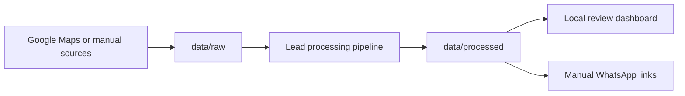

# Data

`data/legacy/` contains preserved historical scraped data.

`data/raw/` is for new scraper outputs.

`data/processed/` is for local working files such as SQLite databases, lead CSVs, summaries, and manual WhatsApp-link exports.

Raw and processed outputs are ignored by git by default because they may contain phone numbers, business contact data, or local workflow state. Review any data file manually before sharing or committing it.

## Data Flow

## Commit Rule

Only commit safe placeholders such as `.gitkeep` files. Real lead data, generated CSVs, local SQLite databases, and legacy datasets should stay local unless they have been manually reviewed and intentionally sanitized.
