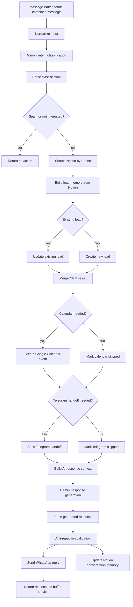

# Conversation Memory for WhatsApp Leads

This document explains the MVP memory layer used by the Autobots n8n workflow.
The goal is to stop the assistant from treating every WhatsApp message as a new
conversation.

## Problem

Without memory, the assistant repeats greetings, asks the same qualifying
questions, and forgets what it already asked. This is especially visible when a
lead replies in short WhatsApp messages.

Example bad flow:

1. Bot: "Que tipo de negocio tenes?"
2. Lead: "Una peluqueria"
3. Bot: "Hola, que tipo de negocio tenes?"

The workflow now retrieves the lead's previous Notion memory before generating a
new reply.

## Memory Flow



## Notion Properties

The workflow expects these Notion database properties:

| Property | Type | Purpose |
|---|---|---|
| Phone | Title | Unique lead identifier used for search/upsert |
| Text | Phone | Clickable phone field |
| Status | Select | Current CRM status |
| Intent | Select | Latest detected intent |
| Last Message | Rich text | Latest user message |
| Summary | Rich text | Short summary from classification |
| Business Type | Rich text | Known business/niche |
| Pain Point | Rich text | Problem the lead wants solved |
| Conversation Summary | Rich text | Compact memory across turns |
| Last User Message | Rich text | Latest inbound WhatsApp message |
| Last Bot Reply | Rich text | Latest AI-generated reply |
| Last Contact At | Date | Last time the lead interacted |
| Lead Stage | Select | Sales stage |
| Buying Intent | Select | low, medium, high, urgent, not_interested |
| Repetition Risk | Checkbox | Whether the anti-repeat guard modified a reply |
| Messages Count | Number | Approximate number of processed turns |

## AI Context Object

Before the response node, the workflow builds a structured context object:

```json
{
  "current_message": "Una peluqueria",
  "lead": {
    "phone": "595...",
    "name": "Guada",
    "business_type": "peluqueria",
    "pain_point": "quiere responder mensajes de clientes mas rapido",
    "status": "qualifying",
    "intent": "interested",
    "lead_stage": "interested",
    "buying_intent": "medium"
  },
  "memory": {
    "conversation_summary": "Guada esta interesada en automatizar respuestas por WhatsApp.",
    "last_user_message": "Una peluqueria",
    "last_bot_reply": "Que tipo de negocio tenes?",
    "messages_count": 2
  },
  "conversation_behavior_rules": {
    "do_not_greet_repeatedly": true,
    "do_not_repeat_questions": true,
    "continue_from_last_bot_reply": true,
    "ask_one_question_at_a_time": true
  }
}
```

## Anti-Repetition Rules

The workflow validates the generated reply before sending it.

It adjusts the response when:

- The bot greets again after greeting in the previous reply.
- The bot asks for business type even though `Business Type` is known.
- The bot repeats a question too similar to `Last Bot Reply`.
- The bot asks about the pain point again when it is already known.

This is a lightweight guard. It is not a replacement for long-term message
history, but it protects the MVP from the most obvious repeated responses.

## Manual Test Cases

### Test 1: First greeting

Lead: `Hola`

Expected:

- Bot greets once.
- Bot asks one useful qualifying question.
- Notion saves `Last User Message` and `Last Bot Reply`.

### Test 2: Business type answer

Memory:

- Last Bot Reply: `Que tipo de negocio tenes?`

Lead: `Una peluqueria`

Expected:

- Bot does not ask business type again.
- Bot connects the answer to peluqueria use cases.
- `Business Type` becomes `peluqueria`.

### Test 3: Known business type

Memory:

- Business Type: `peluqueria`

Lead: `Quiero que respondan los mensajes de mis clientes`

Expected:

- Bot connects the pain point to WhatsApp automation.
- Bot asks about a demo or common inquiries, not business type.
- `Pain Point` is updated.

### Test 4: Answer to previous question

Memory:

- Last Bot Reply: `Que consultas recibis mas seguido?`

Lead: `Precios y horarios`

Expected:

- Bot treats the message as an answer.
- Bot moves forward toward demo or next step.
- Bot does not ask the same question again.

### Test 5: Similar reply

Memory:

- Last Bot Reply is very similar to the new generated reply.

Expected:

- `Repetition Risk` is checked in Notion.
- The reply is replaced with a forward-moving question.

## Next Version

The MVP stores stable memory directly on the lead page. A stronger version should
add a separate `Messages` database with one row per turn:

- phone
- direction: inbound or outbound
- message text
- timestamp
- workflow execution id
- lead page relation

That would allow the AI to receive the last 5 to 10 turns instead of only a
summary and the last messages.
