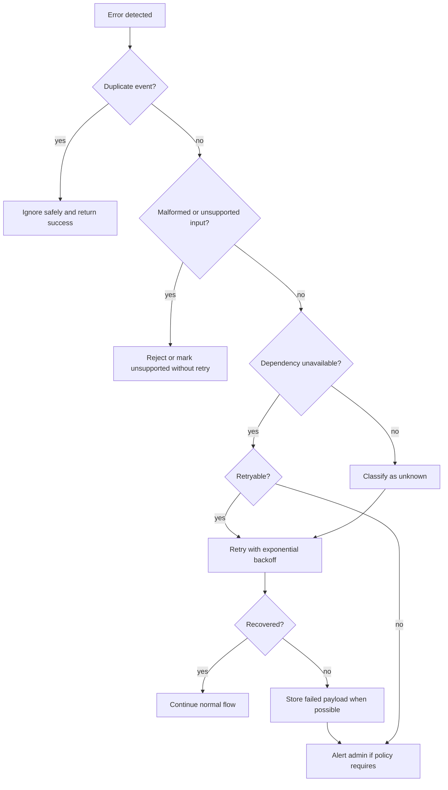
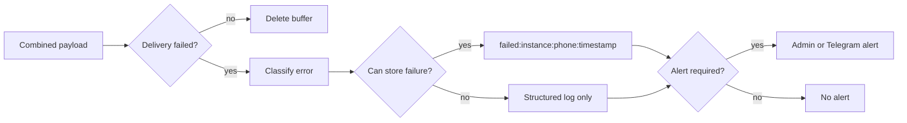

# Error Handling And Fallback Plan

This document defines how Autobots should behave when one part of the WhatsApp automation system fails.

The goal is simple:

- avoid losing leads
- avoid duplicate replies
- avoid exposing internal errors to clients
- alert a human when the business impact is high
- fail gracefully when AI or integrations are unavailable

## System Dependencies

Autobots currently depends on:

- Evolution API
- WhatsApp QR session
- message buffer service
- Redis
- n8n
- Gemini
- Notion
- Telegram
- audio transcription provider

Any of these can fail. The system should assume failure is normal and recover where practical.

## Reliability Decision Flow



## Error Categories

| Category | Retryable | Admin Alert | Silent Ignore | Store Failed Message |
| --- | --- | --- | --- | --- |
| `redis_unavailable` | yes | yes | no | yes, if possible outside Redis |
| `n8n_unavailable` | yes | yes | no | yes |
| `gemini_api_error` | yes | yes | no | no |
| `notion_api_error` | yes | yes | no | no |
| `telegram_error` | yes | no | no | no |
| `evolution_session_disconnected` | yes | yes | no | yes |
| `audio_transcription_failure` | no | no | no | no |
| `duplicate_webhook_event` | no | no | yes | no |
| `malformed_payload` | no | no | no | no |
| `rate_limited_user` | no | yes | no | yes |
| `unsupported_media` | no | no | no | no |
| `unknown` | yes | yes | no | yes |

## Retry Rules

Retry only when the failure is likely temporary.

Retryable:

- Redis connection failure
- n8n unavailable
- Gemini temporary API failure
- Notion temporary API failure
- Telegram temporary delivery failure
- Evolution API temporary failure
- WhatsApp session disconnected after reconnection
- unknown infrastructure errors

Not retryable:

- duplicate webhook event
- malformed webhook payload
- unsupported media
- audio transcription failure after the audio was downloaded and attempted
- user sent too many messages

Default retry policy:

```text
max_attempts: 3
base_delay_seconds: 1
multiplier: 2
max_delay_seconds: 30
```

Example delays:

```text
attempt 1 failed -> wait 1s
attempt 2 failed -> wait 2s
attempt 3 failed -> stop
```

## Admin Alert Rules

Trigger Telegram/admin alert for:

- Redis unavailable
- n8n unavailable after retries
- Gemini unavailable when fallback response is used
- Notion failure after lead was qualified
- Evolution API session disconnected
- WhatsApp QR session disconnected
- user sends too many messages
- unknown errors

Do not alert for:

- duplicate webhook events
- unsupported media, unless volume is suspicious
- normal malformed payload noise
- single audio transcription failure
- Telegram delivery failure, because Telegram itself is the alert channel

## Silent Ignore Rules

Silently ignore duplicate webhook events.

The system should log them at info/debug level and return success to Evolution API to avoid repeated delivery loops.

Do not silently ignore:

- Redis failure
- n8n failure
- WhatsApp session disconnection
- qualified lead delivery failure
- malformed payloads during active debugging

## Failed Message Storage

When n8n delivery fails, keep the combined message payload.

Current Redis key pattern:

```text
failed:{instance}:{phone}:{timestamp}
```

Failed payload should include:

```json
{
  "error": "n8n returned HTTP 500",
  "category": "n8n_unavailable",
  "failed_at": "2026-05-03T00:00:00Z",
  "retryable": true,
  "payload": {
    "instance": "autobots-main",
    "phone": "595981123456",
    "combined_text": "Hola, me interesa..."
  }
}
```

If Redis is unavailable, Redis obviously cannot store the failed message. In that case:

1. return a degraded response to the webhook caller
2. log a structured error without credentials
3. trigger admin alert through a non-Redis path if possible
4. rely on Evolution API webhook retry if configured
5. optionally add a future local file fallback under an ignored runtime directory

Do not store secrets, tokens, session data, or full internal webhook URLs in failed payloads.



## Fallback Behavior If AI Is Unavailable

If Gemini is unavailable or the AI classification/generation step fails, the user should receive:

```text
Gracias por escribir. En este momento estoy derivando tu consulta a una persona del equipo para ayudarte mejor.
```

Then the system should:

- trigger human handoff
- include the latest combined message
- mark the lead as `needs_human_review`
- avoid pretending that the AI answered normally

## Fallback Behavior If Redis Is Unavailable

Redis is required for buffering and deduplication.

If Redis is unavailable at webhook time:

- do not try to generate an AI response from the buffer service
- return a temporary failure when appropriate so the webhook provider can retry
- log `redis_unavailable`
- trigger admin alert if possible
- use the AI unavailable fallback only if another part of the system can still message the user safely

The buffer service should not silently accept a message that it cannot persist.

## Fallback Behavior If Transcription Fails

If audio transcription fails:

- do not block the whole conversation
- add this placeholder to the buffer:

```text
[Voice message received but transcription failed]
```

- continue combining text messages normally
- do not alert admin for a single failure
- alert only if repeated transcription failures happen or provider credentials are broken

## Fallback Behavior If Notion Fails

If Notion CRM update fails:

- do not block the WhatsApp reply
- retry the Notion update if the error is temporary
- trigger admin alert if the lead is qualified or hot
- include CRM status as `crm_update_failed` in logs or handoff metadata
- keep enough lead data in the Telegram handoff so a human can act without Notion

The lead conversation should continue even if Notion is down.

## Specific Failure Plans

### Evolution API Session Disconnected

Impact:

- WhatsApp replies cannot be sent.

Action:

- retry after session reconnects
- alert admin immediately
- ask owner to scan QR again if needed
- store unsent response or handoff payload when possible

### n8n Down

Impact:

- buffered messages cannot reach the automation workflow.

Action:

- retry with exponential backoff
- move payload to failed queue after retries
- alert admin
- do not delete buffer until payload is stored as failed

### Gemini API Error

Impact:

- AI cannot classify or generate response.

Action:

- retry if temporary
- use fallback human handoff message
- alert admin if repeated or affecting active leads

### Telegram Error

Impact:

- human handoff alert may not arrive.

Action:

- retry Telegram delivery
- log the failure
- do not recursively alert through Telegram
- optionally add future backup alert channel

### Unsupported Media

Impact:

- the automation cannot process the message content.

Action:

- optionally reply with a short clarification if the channel supports it
- do not retry
- do not alert admin unless repeated

## Implementation Files

Reliability helpers live in:

```text
src/autobots/services/message_buffer/errors.py
src/autobots/services/message_buffer/retry.py
```

These modules are intentionally small and pure. They classify errors and calculate retry decisions, but they do not send Telegram messages or perform network calls.
