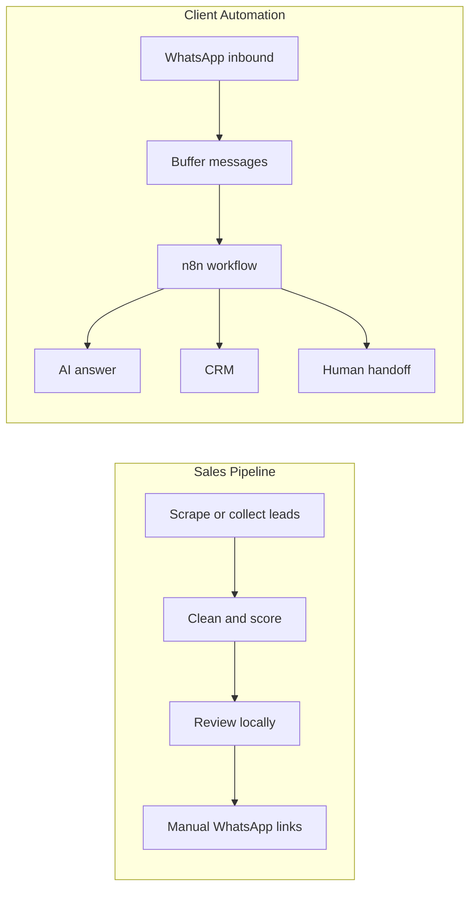

# Architecture

Autobots has two useful legacy foundations: a lead discovery pipeline and a WhatsApp/n8n response automation. The current refactor keeps both, but separates them into clear responsibilities.

Detailed architecture documents:

- `docs/architecture/message-buffer-and-ai-flow.md` - Redis message buffer, transcription, AI response, CRM, and handoff flow.
- `docs/architecture/error_handling.md` - failure classification, fallback behavior, and retry strategy.
- `docs/architecture/telegram_handoff.md` - Telegram alert format for human takeover.
- `docs/architecture/voice-to-text.md` - audio transcription provider strategy.

## High-Level Flow

## Lead Discovery

`src/autobots/scrapers/google_maps.py` scrapes Google Maps businesses in Paraguay and extracts details such as name, phone, category, address, website status, ratings, reviews, photos, hours, and metadata.

Configuration lives in `src/autobots/config/categories.json` and `src/autobots/config/locations.json`.

Generated raw scrape output should go to `data/raw/`.

## Lead Processing

`src/autobots/leads/pipeline.py` converts the legacy dataset into a local SQLite sales database and summary files under `data/processed/`.

`src/autobots/leads/scorer.py` contains reusable scoring logic for prioritizing businesses.

## Manual Outreach

`src/autobots/outreach/whatsapp_links.py` generates `wa.me` links only. It does not send messages.

`src/autobots/outreach/message_generator.py` preserves the previous Excel export flow for manual outreach.

## Dashboard

`src/autobots/dashboard/app.py` preserves the local Flask dashboard used to inspect and manage leads. It is legacy-compatible and may later be replaced by Notion or another lightweight CRM.

## WhatsApp Automation

`n8n/workflows/` contains previous n8n workflow JSON exports. These are context for future client automations, especially inbound question answering, CRM saving, and human handoff.

The workflow exports are intentionally credential-free. After importing them into n8n, configure fresh credentials for Evolution API, Telegram, Notion, and AI providers.

Deployment uses `docker-compose.yml` with environment variables. Real values belong in `.env`, never in committed files.

## Current Boundary

This repo is organized for safe preparation. Outbound WhatsApp automation is not implemented here yet.

The current strategy is to build the automation agency in layers: first organize leads and manual outreach, then prove the inbound WhatsApp automation with a demo, then package repeatable client flows.
