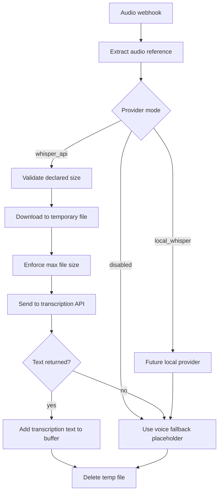

# Voice-To-Text Architecture

The message buffer service supports voice notes by converting audio messages into text before they are appended to the Redis buffer.

## Goal

When a WhatsApp user sends audio and then text:

```text
audio: "Hola, estoy interesado en el departamento"
text: "Me pasas mas info?"
```

The buffer should forward one combined message to n8n:

```text
[Audio transcription]: Hola, estoy interesado en el departamento. Me pasas mas info?
```

The buffer service still does not send WhatsApp replies directly. It only receives Evolution API webhooks, buffers messages, and forwards combined payloads to n8n.

## Audio Handling Flow



## Provider Modes

`TRANSCRIPTION_PROVIDER` controls transcription behavior:

```env
TRANSCRIPTION_PROVIDER=disabled
```

Supported modes:

- `disabled`: voice notes are converted to the fallback placeholder without downloading audio.
- `whisper_api`: audio is safely downloaded to a temporary file and sent to a Whisper-compatible HTTP API.
- `local_whisper`: reserved placeholder for a future local Whisper implementation. It currently falls back without heavy dependencies.

## Safe Audio Handling

Audio handling follows these rules:

- Do not log audio URLs, API keys, media keys, or raw base64 data.
- Reject audio larger than `MAX_AUDIO_SIZE_MB`.
- Check declared `fileLength` when Evolution provides it.
- Check `Content-Length` before streaming downloads when available.
- Enforce the size limit while streaming bytes.
- Save audio only to a temporary file.
- Delete temporary files after transcription succeeds or fails.

Required environment variables:

```env
TRANSCRIPTION_PROVIDER=disabled
WHISPER_API_KEY=
WHISPER_API_URL=https://api.openai.com/v1/audio/transcriptions
AUDIO_DOWNLOAD_TIMEOUT_SECONDS=15
MAX_AUDIO_SIZE_MB=10
```

## Failure Behavior

If transcription fails for any reason, the buffer still receives a usable text fragment:

```text
[Voice message received but transcription failed]
```

This prevents a voice note from blocking the debounce flow forever.

Failure examples:

- Missing audio URL or embedded media.
- Audio is too large.
- Whisper API key is missing.
- Whisper API returns a non-2xx response.
- Whisper API response does not include text.
- Local Whisper mode is selected before implementation.

## Whisper API Flow

```text
Evolution audio webhook
  -> parse audio metadata
  -> check declared size
  -> download or decode audio into temp file
  -> enforce max size during download
  -> send multipart request to WHISPER_API_URL
  -> receive text
  -> append "[Audio transcription]: {text}" to Redis buffer
  -> delete temp file
```

The default `WHISPER_API_URL` is OpenAI-compatible:

```env
WHISPER_API_URL=https://api.openai.com/v1/audio/transcriptions
```

No real API key should ever be committed.

## Redis Buffer Result

Audio messages are stored as normal buffered messages with:

- `message_type=audio`
- `text` set to either the transcription prefix or failure placeholder
- `audio.transcription_provider`
- `audio.transcription_status`

The final n8n payload keeps audio metadata in `audio_messages`, but the AI-facing content is still in `combined_text`.

## Future Improvements

- Implement `local_whisper` with Faster Whisper in a separate worker container.
- Support Evolution API authenticated media download when URLs are not directly accessible.
- Add language hints per client.
- Add per-client transcription provider settings.
- Add Telegram handoff when an audio-only message fails transcription.
- Store transcription latency metrics.
