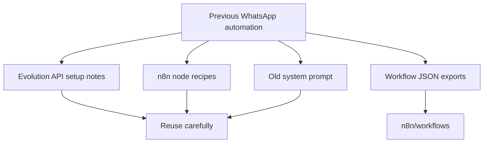

# Previous WhatsApp Automation Context

This folder preserves documentation from the previous n8n WhatsApp response automation.

It includes Evolution API notes, additional n8n node designs, the old agent prompt, and technical PDFs. Workflow JSON exports were moved to `n8n/workflows/`.

## Legacy Context Map

Before reusing this material, review it for:

- old campaign-specific language
- client-specific data
- WhatsApp session handling
- placeholder tokens or private URLs
- old business context that does not match Autobots clients
