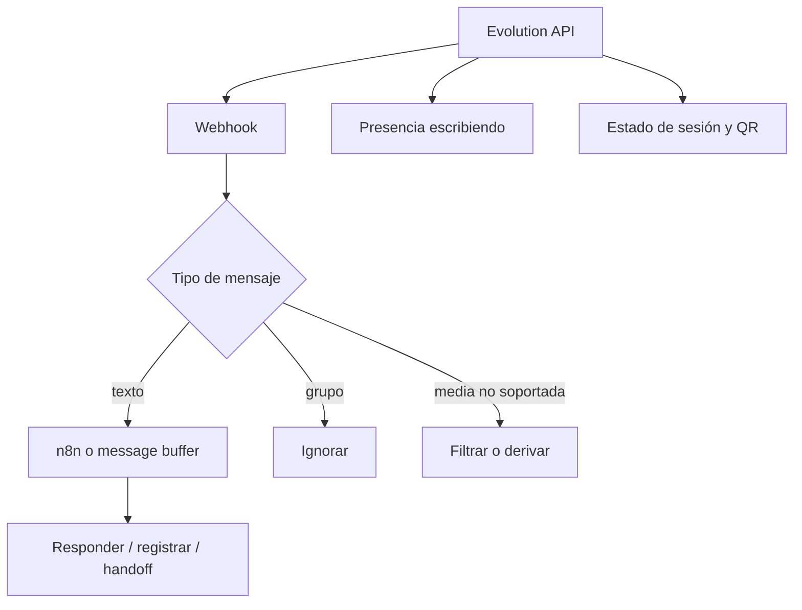

# GUÍA EVOLUTION API - CONFIGURACIÓN AVANZADA
# Webhooks, filtros, grupos, presencia y debugging
# Para proyecto WhatsApp IA 

---

## MAPA RÁPIDO



Esta guía es contexto heredado. Antes de usarla en un cliente real, reemplazar placeholders, revisar endpoints y validar que la versión actual de Evolution API mantenga la misma estructura.

## 1. CONFIGURAR WEBHOOK PARA SOLO MENSAJES DE TEXTO

Por defecto, Evolution API envía TODOS los tipos de mensajes al webhook (texto, imágenes, stickers, audios, etc.). Para filtrar solo texto, hay dos opciones:

### OPCIÓN A: Filtrar en n8n (RECOMENDADO)

Agregar esta condición en el nodo "IF Filtro" de n8n:

```javascript
// En el nodo IF Filtro, agregar esta condición adicional:
// Condición: {{ $json.mensaje }} no está vacío

// El campo "mensaje" en Set Fields solo extrae texto:
// mensaje = $json.body?.data?.message?.conversation 
//           ?? $json.body?.data?.message?.extendedTextMessage?.text ?? ''

// Si el mensaje es imagen, sticker, audio, etc., el campo queda vacío
// y el IF lo filtra automáticamente
```

Esta condición ya está en el flujo que te di. Los mensajes sin texto (imágenes, stickers, etc.) quedan con `mensaje = ''` y el IF los descarta.

### OPCIÓN B: Configurar en Evolution API (variables de entorno)

Agregar estas variables al docker-compose en el contenedor evolution-api:

```yaml
environment:
  # ... otras variables existentes ...
  
  # Solo disparar webhook en mensajes de texto
  - WEBHOOK_EVENTS_MESSAGES_UPSERT=true
  - WEBHOOK_EVENTS_MESSAGES_UPDATE=false
  - WEBHOOK_EVENTS_MESSAGES_DELETE=false
  - WEBHOOK_EVENTS_SEND_MESSAGE=false
  - WEBHOOK_EVENTS_CONTACTS_SET=false
  - WEBHOOK_EVENTS_CONTACTS_UPSERT=false
  - WEBHOOK_EVENTS_CONTACTS_UPDATE=false
  - WEBHOOK_EVENTS_PRESENCE_UPDATE=false
  - WEBHOOK_EVENTS_CHATS_SET=false
  - WEBHOOK_EVENTS_CHATS_UPSERT=false
  - WEBHOOK_EVENTS_CHATS_UPDATE=false
  - WEBHOOK_EVENTS_CHATS_DELETE=false
  - WEBHOOK_EVENTS_GROUPS_UPSERT=false
  - WEBHOOK_EVENTS_GROUPS_UPDATE=false
  - WEBHOOK_EVENTS_GROUP_PARTICIPANTS_UPDATE=false
  - WEBHOOK_EVENTS_CONNECTION_UPDATE=false
  - WEBHOOK_EVENTS_LABELS_EDIT=false
  - WEBHOOK_EVENTS_LABELS_ASSOCIATION=false
  - WEBHOOK_EVENTS_CALL=false
```

Después de modificar el docker-compose, reiniciar:

```bash
ssh -i ~/.ssh/campana-whatsapp root@<SERVER_IP_OR_DOMAIN>
cd ~/campana
docker compose down
docker compose up -d
```

---

## 2. IGNORAR GRUPOS AUTOMÁTICAMENTE

### OPCIÓN A: Ya implementado en n8n

El nodo "IF Filtro" ya tiene esta condición:

```javascript
// isGroup = {{ $json.body?.data?.key?.remoteJid?.endsWith('@g.us') }}
// Condición: {{ $json.isGroup }} igual a false
```

Los mensajes de grupos tienen remoteJid terminando en `@g.us` (grupos normales) o `@broadcast` (listas de difusión). El filtro actual los descarta.

### OPCIÓN B: Configurar en la instancia de Evolution API

Ejecutar este curl para configurar la instancia para ignorar grupos:

```bash
curl -X PUT "http://<SERVER_IP_OR_DOMAIN>:8080/settings/set/campana-slot2" \
  -H "apikey: <EVOLUTION_API_KEY>" \
  -H "Content-Type: application/json" \
  -d '{
    "rejectCall": false,
    "msgCall": "",
    "groupsIgnore": true,
    "alwaysOnline": false,
    "readMessages": false,
    "readStatus": false,
    "syncFullHistory": false
  }'
```

**Respuesta esperada:**
```json
{
  "settings": {
    "rejectCall": false,
    "groupsIgnore": true,
    ...
  }
}
```

Para verificar la configuración actual:

```bash
curl "http://<SERVER_IP_OR_DOMAIN>:8080/settings/find/campana-slot2" \
  -H "apikey: <EVOLUTION_API_KEY>"
```

---

## 3. VERIFICAR QUE WEBHOOKS LLEGAN A N8N

### Paso 1: Verificar configuración de webhook en Evolution API

```bash
curl "http://<SERVER_IP_OR_DOMAIN>:8080/webhook/find/campana-slot2" \
  -H "apikey: <EVOLUTION_API_KEY>"
```

**Respuesta esperada:**
```json
{
  "webhook": {
    "enabled": true,
    "url": "http://<SERVER_IP_OR_DOMAIN>:5678/webhook/campana",
    "webhookByEvents": true,
    "events": ["MESSAGES_UPSERT"]
  }
}
```

Si no está configurado o está mal, configurarlo manualmente:

```bash
curl -X POST "http://<SERVER_IP_OR_DOMAIN>:8080/webhook/set/campana-slot2" \
  -H "apikey: <EVOLUTION_API_KEY>" \
  -H "Content-Type: application/json" \
  -d '{
    "enabled": true,
    "url": "http://<SERVER_IP_OR_DOMAIN>:5678/webhook/campana",
    "webhookByEvents": true,
    "events": ["MESSAGES_UPSERT"]
  }'
```

### Paso 2: Verificar que n8n está escuchando

1. Abrir n8n: `http://<SERVER_IP_OR_DOMAIN>:5678`
2. Ir al workflow "Agente WhatsApp PoC"
3. El workflow debe estar **ACTIVE** (toggle verde arriba a la derecha)
4. Verificar que el nodo Webhook dice: `http://<SERVER_IP_OR_DOMAIN>:5678/webhook/campana`

### Paso 3: Probar manualmente

Desde cualquier teléfono, mandar un mensaje de WhatsApp al número conectado.

Verificar en n8n → Executions:
- Si aparece una ejecución nueva → el webhook está funcionando
- Si no aparece nada → revisar logs

### Paso 4: Ver logs de Evolution API

```bash
ssh -i ~/.ssh/campana-whatsapp root@<SERVER_IP_OR_DOMAIN>
cd ~/campana
docker compose logs --tail=50 evolution-api | grep -i webhook
```

Buscar líneas como:
```
[INFO] Sending webhook to: http://<SERVER_IP_OR_DOMAIN>:5678/webhook/campana
[INFO] Webhook response: 200
```

Si ves errores de conexión, verificar que n8n está corriendo:

```bash
docker compose ps
curl http://<SERVER_IP_OR_DOMAIN>:5678/healthz
```

### Paso 5: Debugging desde el Manager

1. Abrir: `http://<SERVER_IP_OR_DOMAIN>:8080/manager`
2. Ingresar API Key: `<EVOLUTION_API_KEY>`
3. Buscar la instancia `campana-slot2`
4. Clic en "Settings" o "Webhook"
5. Verificar que la URL está correcta y enabled=true

---

## 4. ACTIVAR "ESCRIBIENDO..." ANTES DE RESPONDER

Para que parezca más humano, activar el estado "composing" (escribiendo...) antes de enviar la respuesta.

### Nodo HTTP Request para sendPresence:

Agregar este nodo ANTES del nodo "Evolution API Send" y DESPUÉS del "Wait":

```json
{
  "parameters": {
    "method": "POST",
    "url": "http://<SERVER_IP_OR_DOMAIN>:8080/chat/updatePresence/campana-slot2",
    "sendHeaders": true,
    "headerParameters": {
      "parameters": [
        {
          "name": "apikey",
          "value": "<EVOLUTION_API_KEY>"
        },
        {
          "name": "Content-Type",
          "value": "application/json"
        }
      ]
    },
    "sendBody": true,
    "specifyBody": "json",
    "jsonBody": "={\n  \"number\": \"{{ $json.celular }}\",\n  \"presence\": \"composing\"\n}"
  },
  "name": "Escribiendo...",
  "type": "n8n-nodes-base.httpRequest",
  "typeVersion": 4.2,
  "position": [1900, 420]
}
```

### Valores posibles de presence:

| Valor | Descripción |
|-------|-------------|
| `composing` | "Escribiendo..." |
| `recording` | "Grabando audio..." |
| `paused` | Detiene el indicador |
| `available` | En línea |
| `unavailable` | Desconectado |

### Flujo recomendado:

```
Wait (delay anti-ban)
      ↓
Escribiendo... (sendPresence: composing)
      ↓
Wait 2 segundos (para que se vea el "escribiendo")
      ↓
Evolution API Send (envía el mensaje)
```

### Nodo Wait adicional para el efecto:

```json
{
  "parameters": {
    "amount": 2,
    "unit": "seconds"
  },
  "name": "Wait Typing",
  "type": "n8n-nodes-base.wait",
  "typeVersion": 1.1
}
```

### Curl para probar manualmente:

```bash
# Activar "escribiendo..."
curl -X POST "http://<SERVER_IP_OR_DOMAIN>:8080/chat/updatePresence/campana-slot2" \
  -H "apikey: <EVOLUTION_API_KEY>" \
  -H "Content-Type: application/json" \
  -d '{
    "number": "595981123456",
    "presence": "composing"
  }'

# Esperar 2 segundos y enviar mensaje
sleep 2

curl -X POST "http://<SERVER_IP_OR_DOMAIN>:8080/message/sendText/campana-slot2" \
  -H "apikey: <EVOLUTION_API_KEY>" \
  -H "Content-Type: application/json" \
  -d '{
    "number": "595981123456",
    "text": "Hola, este es un mensaje de prueba"
  }'
```

---

## 5. COMANDOS DE REFERENCIA RÁPIDA

### Estado de conexión
```bash
curl http://<SERVER_IP_OR_DOMAIN>:8080/instance/connectionState/campana-slot2 \
  -H "apikey: <EVOLUTION_API_KEY>"
```

### Regenerar QR
```bash
curl "http://<SERVER_IP_OR_DOMAIN>:8080/instance/connect/campana-slot2" \
  -H "apikey: <EVOLUTION_API_KEY>"
```

### Desconectar sesión (logout)
```bash
curl -X DELETE "http://<SERVER_IP_OR_DOMAIN>:8080/instance/logout/campana-slot2" \
  -H "apikey: <EVOLUTION_API_KEY>"
```

### Reiniciar instancia
```bash
curl -X PUT "http://<SERVER_IP_OR_DOMAIN>:8080/instance/restart/campana-slot2" \
  -H "apikey: <EVOLUTION_API_KEY>"
```

### Ver información de la instancia
```bash
curl "http://<SERVER_IP_OR_DOMAIN>:8080/instance/fetchInstances" \
  -H "apikey: <EVOLUTION_API_KEY>"
```

### Enviar mensaje de texto
```bash
curl -X POST "http://<SERVER_IP_OR_DOMAIN>:8080/message/sendText/campana-slot2" \
  -H "apikey: <EVOLUTION_API_KEY>" \
  -H "Content-Type: application/json" \
  -d '{
    "number": "595981123456",
    "text": "Mensaje de prueba"
  }'
```

### Marcar mensaje como leído
```bash
curl -X POST "http://<SERVER_IP_OR_DOMAIN>:8080/chat/markMessageAsRead/campana-slot2" \
  -H "apikey: <EVOLUTION_API_KEY>" \
  -H "Content-Type: application/json" \
  -d '{
    "readMessages": [
      {
        "remoteJid": "595981123456@s.whatsapp.net",
        "id": "MESSAGE_ID_AQUI"
      }
    ]
  }'
```

---

## 6. TROUBLESHOOTING COMÚN

### Problema: Webhook no llega a n8n

1. Verificar que el workflow está activo (toggle verde)
2. Verificar URL del webhook en Evolution API settings
3. Verificar que ambos servicios están corriendo: `docker compose ps`
4. Verificar logs: `docker compose logs --tail=100 evolution-api`

### Problema: WhatsApp se desconecta frecuentemente

1. Verificar que el celular tiene conexión estable a internet
2. Verificar que no hay otra sesión activa del mismo número
3. Agregar variable para evitar desconexiones:
   ```yaml
   - DEL_INSTANCE_ON_DISCONNECT=false
   - STORE_MESSAGES=true
   ```

### Problema: QR no se genera

1. Verificar Redis está corriendo: `docker compose logs redis`
2. Verificar variable CONFIG_SESSION_PHONE_VERSION está configurada
3. Reiniciar contenedores: `docker compose restart evolution-api`

### Problema: Mensajes se envían pero no llegan

1. Verificar formato del número (debe ser 595XXXXXXXXX sin +, sin espacios)
2. Verificar que el número tiene WhatsApp activo
3. Verificar que no estás bloqueado por el destinatario

---

## RESUMEN DE CONFIGURACIONES A APLICAR

| Configuración | Método | ¿Aplicado? |
|---------------|--------|------------|
| Filtrar solo texto | n8n IF Filtro | ✅ Ya incluido |
| Ignorar grupos | n8n IF Filtro | ✅ Ya incluido |
| groupsIgnore en API | curl PUT settings | ⬜ Ejecutar curl |
| Webhook events | Variables docker | ⬜ Opcional |
| sendPresence | Nuevo nodo n8n | ⬜ Agregar nodo |
| Error workflow | Workflow separado | ⬜ Importar JSON |
