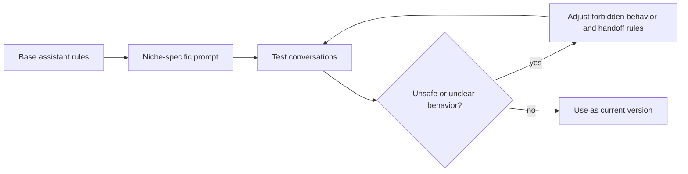

Here I will upload all the instructions for my AI agent.

This will constantly change and will have multiple versions, one for each niche.

## Prompt Versioning Flow

```mermaid
flowchart LR
    A[Base assistant rules] --> B[Niche-specific prompt]
    B --> C[Test conversations]
    C --> D{Unsafe or unclear behavior?}
    D -- yes --> E[Adjust forbidden behavior and handoff rules]
    E --> C
    D -- no --> F[Use as current version]
```

