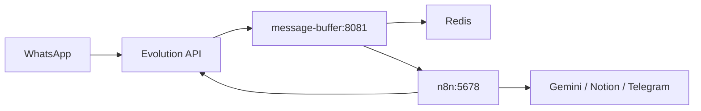

# Docker Local Deployment

This guide runs the local Autobots WhatsApp automation stack with Redis, the FastAPI message buffer, n8n, and the existing Evolution API service.

No real tokens belong in this file or in git. Copy `.env.example` to `.env` and fill local values there.

## Local Service Topology



Use this file when you want the local containers to behave like the intended production routing: Evolution sends incoming messages to the buffer service, and the buffer service forwards one combined payload to n8n.

## 1. Run Redis

Redis is defined in `docker-compose.yml` using the official image:

```yaml
redis:
  image: redis:7-alpine
```

Start only Redis:

```bash
docker compose up -d redis
```

Check health:

```bash
docker compose ps redis
docker compose logs -f redis
```

Inside Docker, services should use:

```env
REDIS_URL=redis://redis:6379/0
```

If you run the buffer service directly from your terminal instead of Docker, use:

```env
REDIS_URL=redis://localhost:6379/0
```

## 2. Run The Buffer Service

The `message-buffer` service builds from `Dockerfile.message-buffer` and runs:

```bash
uvicorn autobots.services.message_buffer.app:app --host 0.0.0.0 --port 8081
```

Start Redis and the buffer service:

```bash
docker compose up -d redis message-buffer
```

Check health:

```bash
curl http://localhost:8081/health
```

Expected response shape:

```json
{
  "status": "ok",
  "redis": true,
  "n8n_configured": true
}
```

For local development without Docker:

```bash
PYTHONPATH=src REDIS_URL=redis://localhost:6379/0 N8N_WEBHOOK_URL=http://localhost:5678/webhook/whatsapp-buffer .venv/bin/uvicorn autobots.services.message_buffer.app:app --host 0.0.0.0 --port 8081 --reload
```

The compose file does not mount source code into the container. That keeps the default Docker stack closer to production. Use the local command above when you want live reload while editing code.

## 3. Connect Evolution API To The Buffer Service

Evolution API should send incoming WhatsApp webhook events to the buffer service, not directly to n8n.

Docker service URL:

```env
EVOLUTION_WEBHOOK_URL=http://message-buffer:8081/webhook/evolution
```

Public/local browser URL:

```text
http://localhost:8081/webhook/evolution
```

In `docker-compose.yml`, Evolution uses:

```env
WEBHOOK_GLOBAL_URL=${EVOLUTION_WEBHOOK_URL:-http://message-buffer:8081/webhook/evolution}
WEBHOOK_EVENTS_MESSAGES_UPSERT=true
```

After changing webhook variables, restart Evolution API:

```bash
docker compose up -d evolution-api
docker compose restart evolution-api
```

The buffer service accepts:

```text
POST /webhook/evolution
```

It parses the Evolution payload, deduplicates by message id, stores messages in Redis by instance and phone, and waits for the debounce window before forwarding to n8n.

## 4. Connect The Buffer Service To n8n

The buffer service sends combined messages to:

```env
N8N_WEBHOOK_URL=http://n8n:5678/webhook/whatsapp-buffer
```

Create an n8n workflow with a webhook path:

```text
whatsapp-buffer
```

The buffer service will send a payload shaped like:

```json
{
  "buffer_id": "stable-id",
  "instance": "autobots-demo",
  "phone": "595981123456",
  "push_name": "Nico",
  "combined_text": "Hola Nico Como estas?",
  "message_count": 3,
  "event_ids": ["msg-1", "msg-2", "msg-3"],
  "contains_audio": false,
  "audio_messages": [],
  "first_timestamp": "2026-05-02T12:00:00Z",
  "last_timestamp": "2026-05-02T12:00:06Z"
}
```

n8n should handle Gemini response generation, Notion CRM updates, Telegram handoff, and the final WhatsApp response through Evolution API.

The buffer service must not send WhatsApp replies directly.

## 5. Debug Logs

Follow all services:

```bash
docker compose logs -f
```

Follow only the buffer service:

```bash
docker compose logs -f message-buffer
```

Follow Evolution API:

```bash
docker compose logs -f evolution-api
```

Follow n8n:

```bash
docker compose logs -f n8n
```

Useful checks:

```bash
docker compose ps
curl http://localhost:8081/health
docker compose exec redis redis-cli ping
docker compose exec redis redis-cli keys '*'
```

Use `LOG_LEVEL=DEBUG` in `.env` when diagnosing parsing or debounce behavior. Avoid committing `.env`.

## 6. Restart Services Safely

Restart only the buffer service after code/config changes:

```bash
docker compose up -d --build message-buffer
```

Restart n8n without touching Redis:

```bash
docker compose restart n8n
```

Restart Evolution API after webhook changes:

```bash
docker compose restart evolution-api
```

Stop the local stack without deleting data volumes:

```bash
docker compose down
```

Stop and delete local Docker volumes only when you intentionally want to clear local state:

```bash
docker compose down -v
```

Be careful with `down -v`: it removes local Redis, n8n, Evolution, and Postgres volume data.
