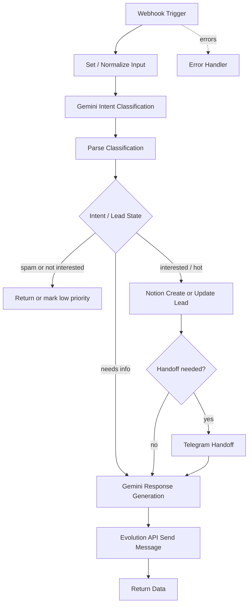

# WhatsApp Buffered Inbound n8n Workflow

This document explains how to build the new n8n workflow that receives one combined message from the FastAPI message buffer service and decides how to respond.

Template file:

```text
n8n/workflows/whatsapp_buffered_inbound_template.json
```

The JSON export is best-effort because n8n node internals can change between versions. Use this guide as the source of truth if the import needs manual adjustment.

## Workflow Diagram



## Purpose

The buffer service already handles:

- Evolution API inbound webhook parsing.
- Redis buffering by `instance + phone`.
- Debouncing short consecutive WhatsApp messages.
- Voice-to-text fallback/transcription.
- Forwarding one combined payload to n8n.

n8n should handle:

- Intent classification.
- Lead creation/update in Notion.
- Telegram handoff for hot leads.
- Response generation.
- WhatsApp response through Evolution API.

## Expected Input

The workflow receives:

```json
{
  "instance": "autobots-main",
  "phone": "595XXXXXXXXX",
  "push_name": "Juan",
  "message_type": "text",
  "combined_text": "Hola Nico como estas? Si me interesa tu propuesta",
  "messages": [
    {
      "message_id": "...",
      "timestamp": "...",
      "type": "text",
      "text": "Hola"
    }
  ],
  "source": "message-buffer"
}
```

The current Python service may also include fields such as `buffer_id`, `message_count`, `event_ids`, `contains_audio`, and `audio_messages`. Keep those fields; they are useful for traceability and idempotency.

## Required Environment Variables

Configure these in n8n or Docker:

```env
GEMINI_API_KEY=
GEMINI_MODEL=gemini-2.5-flash
NOTION_TOKEN=
NOTION_DATABASE_ID=
TELEGRAM_BOT_TOKEN=
TELEGRAM_CHAT_ID=
EVOLUTION_API_KEY=
EVOLUTION_SERVER_URL=http://evolution-api:8080
```

Do not hardcode these values in workflow JSON.

## Required Credentials

Use n8n credentials where possible:

- Google Gemini API credential, or HTTP Request with `GEMINI_API_KEY` env var.
- Notion API token.
- Telegram Bot credential.
- Evolution API key passed as `apikey` header.

The template uses environment-variable placeholders so it can stay public and credential-free.

## Node-By-Node Design

### 1. Webhook Trigger

Node name:

```text
Webhook Trigger
```

Settings:

- Method: `POST`
- Path: `whatsapp-buffer`
- Response mode: response node

The buffer service should point `N8N_WEBHOOK_URL` to:

```env
http://n8n:5678/webhook/whatsapp-buffer
```

### 2. Set / Normalize Input

Node name:

```text
Set / Normalize Input
```

Recommended logic:

- Normalize `phone` to digits only.
- Default `instance` to `autobots-main`.
- Default `source` to `message-buffer`.
- Trim whitespace in `combined_text`.
- Preserve `messages`, `buffer_id`, and `push_name`.

This creates a stable object for the rest of the workflow.

### 3. Gemini Intent Classification

Node name:

```text
Gemini Intent Classification
```

Goal:

Classify the message before deciding what the workflow should do.

Use Gemini 2.5 Flash by default:

```env
GEMINI_MODEL=gemini-2.5-flash
```

Expected classification JSON:

```json
{
  "intent": "interested",
  "lead_status": "qualifying",
  "should_reply": true,
  "should_update_crm": true,
  "should_handoff": false,
  "handoff_reason": null,
  "is_spam": false,
  "confidence": 0.91,
  "next_question": "Que tipo de negocio tenes?",
  "summary": "El contacto muestra interes en la propuesta de automatizacion."
}
```

Allowed `intent` values:

- `interested`
- `not_interested`
- `needs_more_info`
- `spam`
- `unknown`

### 4. Parse Classification

Node name:

```text
Parse Classification
```

Use a Code node to parse Gemini JSON defensively.

Fallback if Gemini returns invalid JSON:

- `intent=unknown`
- `should_reply=true`
- `should_update_crm=true`
- `should_handoff=true`
- `handoff_reason=Gemini classification JSON parse failed`

### 5. IF: Interested / Not Interested / Needs More Info / Spam

Node name:

```text
IF: Interested / Not Interested / Needs More Info / Spam
```

Recommended behavior:

- If `is_spam=true` or `intent=spam`, do not reply.
- If `intent=not_interested`, optionally update CRM as not interested and do not continue conversation.
- If `intent=interested`, continue to Notion and response generation.
- If `intent=needs_more_info`, continue to Notion and ask a qualifying question.

The template includes a simplified IF branch for spam/not interested. You can expand this later into a Switch node with one branch per intent.

### 6. Notion Create Or Update Lead

Node name:

```text
Notion Create or Update Lead
```

Production behavior should be:

1. Search Notion by `phone`.
2. If a page exists, update it.
3. If not, create it.

Recommended fields:

- Phone
- Name
- Status
- Intent
- Last Message
- Summary
- Source
- Last Contacted At
- Handoff Needed
- Handoff Reason

The template uses a simple create-page HTTP node. Treat it as a placeholder until the real Notion schema is finalized.

### 7. IF: Telegram Handoff Needed

Node name:

```text
IF: Telegram Handoff Needed
```

Trigger handoff when:

- `should_handoff=true`
- Contact is a hot lead.
- Contact asks for a human.
- The message is urgent or angry.
- Gemini confidence is low.
- Voice transcription failed and there is not enough context.

### 8. Telegram Handoff

Node name:

```text
Telegram Handoff
```

Message should include:

- Name
- Phone
- Intent
- Lead status
- Handoff reason
- Last combined message

Keep it short enough for a salesperson to scan quickly.

### 9. Gemini Response Generation

Node name:

```text
Gemini Response Generation
```

Generate a concise WhatsApp reply.

Rules:

- Natural Spanish.
- Short and clear.
- Ask one useful next question when qualification is needed.
- Do not mention AI.
- Do not invent prices, availability, or promises.
- If the contact is ready for human follow-up, acknowledge and say someone will contact them.

### 10. Evolution API Send Message

Node name:

```text
Evolution API Send Message
```

Send the reply through Evolution API:

```text
POST {EVOLUTION_SERVER_URL}/message/sendText/{instance}
```

Headers:

```text
apikey: {EVOLUTION_API_KEY}
Content-Type: application/json
```

Body:

```json
{
  "number": "595XXXXXXXXX",
  "text": "Respuesta generada"
}
```

### 11. Return Data To Buffer Service

Node name:

```text
Return Data To Buffer Service
```

Return a JSON response to the FastAPI buffer service:

```json
{
  "ok": true,
  "phone": "595XXXXXXXXX",
  "intent": "interested",
  "handoff": false,
  "reply_sent": true
}
```

### 12. Error Handler

Node name:

```text
Error Handler
```

Use an Error Trigger workflow or a second trigger in the template to alert Telegram when the workflow fails.

The error alert should include:

- workflow name
- failed node
- error message
- execution id if available

## Recommended Improvements After Import

- Replace the simplified IF node with a Switch node for each intent.
- Add Notion search-before-create.
- Add idempotency using `buffer_id` to avoid duplicate CRM updates.
- Add a "human takeover" field that pauses AI replies.
- Add a separate workflow for error handling if n8n import does not like multiple triggers.
- Add a sanitized demo workflow later for public portfolio presentation.
