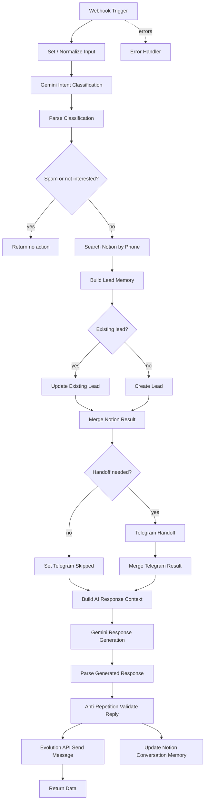

# WhatsApp Buffered Inbound n8n Workflow

This document explains how to build the n8n workflow that receives one combined message from the FastAPI message buffer service, retrieves Notion conversation memory, and decides how to respond.

Template file:

```text
n8n/workflows/whatsapp_buffered_inbound_template.json
```

The JSON export is best-effort because n8n node internals can change between versions. Use this guide as the source of truth if the import needs manual adjustment.

## Workflow Diagram


```mermaid
flowchart TD
    A[Webhook Trigger] --> B[Set / Normalize Input]
    B --> C[Gemini Intent Classification]
    C --> D[Parse Classification]
    D --> E{Spam or not interested?}
    E -- yes --> F[Return no action]
    E -- no --> G[Search Notion by Phone]
    G --> H[Build Lead Memory]
    H --> I{Existing lead?}
    I -- yes --> J[Update Existing Lead]
    I -- no --> K[Create Lead]
    J --> L[Merge Notion Result]
    K --> L
    L --> M{Handoff needed?}
    M -- yes --> N[Telegram Handoff]
    M -- no --> O[Set Telegram Skipped]
    N --> P[Merge Telegram Result]
    O --> Q[Build AI Response Context]
    P --> Q
    Q --> R[Gemini Response Generation]
    R --> S[Parse Generated Response]
    S --> T[Anti-Repetition Validate Reply]
    T --> U[Evolution API Send Message]
    T --> V[Update Notion Conversation Memory]
    U --> W[Return Data]
    A -. errors .-> X[Error Handler]
```

## Purpose

The buffer service already handles:

- Evolution API inbound webhook parsing.
- Redis buffering by `instance + phone`.
- Debouncing short consecutive WhatsApp messages.
- Voice-to-text fallback/transcription.
- Forwarding one combined payload to n8n.

n8n should handle:

- Intent classification.
- Lead search, creation, and update in Notion.
- Conversation memory retrieval before response generation.
- Telegram handoff for hot leads.
- Response generation.
- Anti-repetition validation before sending.
- Conversation memory update after the AI reply.
- WhatsApp response through Evolution API.

## Expected Input

The workflow receives:

```json
{
  "instance": "autobots-main",
  "phone": "595XXXXXXXXX",
  "push_name": "Juan",
  "message_type": "text",
  "combined_text": "Hola Nico como estas? Si me interesa tu propuesta",
  "messages": [
    {
      "message_id": "...",
      "timestamp": "...",
      "type": "text",
      "text": "Hola"
    }
  ],
  "source": "message-buffer"
}
```

The current Python service may also include fields such as `buffer_id`, `message_count`, `event_ids`, `contains_audio`, and `audio_messages`. Keep those fields; they are useful for traceability and idempotency.

## Required Environment Variables

Configure these in n8n or Docker:

```env
GEMINI_API_KEY=
GEMINI_MODEL=gemini-2.5-flash
GEMINI_CLASSIFICATION_MODEL=gemini-2.5-flash
GEMINI_RESPONSE_MODEL=gemini-2.5-pro
NOTION_TOKEN=
NOTION_DATABASE_ID=
TELEGRAM_BOT_TOKEN=
TELEGRAM_CHAT_ID=
GOOGLE_CALENDAR_ID=primary
EVOLUTION_API_KEY=
EVOLUTION_SERVER_URL=http://evolution-api:8080
N8N_BUFFERED_WEBHOOK_SECRET=
```

Do not hardcode these values in workflow JSON.

## Required Credentials

Use n8n credentials where possible:

- Google Gemini API credential, or HTTP Request with `GEMINI_API_KEY` env var.
- Notion API token.
- Telegram Bot credential.
- Evolution API key passed as `apikey` header.

The template uses environment-variable placeholders so it can stay public and credential-free.

## Node-By-Node Design

### 1. Webhook Trigger

Node name:

```text
Webhook Trigger
```

Settings:

- Method: `POST`
- Path: `whatsapp-buffer`
- Response mode: response node
- The first code node rejects requests unless the `X-Autobots-Webhook-Secret` header matches `N8N_BUFFERED_WEBHOOK_SECRET`.

The buffer service should point `N8N_WEBHOOK_URL` to:

```env
http://n8n:5678/webhook/whatsapp-buffer
```

### 2. Set / Normalize Input

Node name:

```text
Set / Normalize Input
```

Recommended logic:

- Normalize `phone` to digits only.
- Default `instance` to `autobots-main`.
- Default `source` to `message-buffer`.
- Trim whitespace in `combined_text`.
- Preserve `messages`, `buffer_id`, and `push_name`.

This creates a stable object for the rest of the workflow.

### 3. Gemini Intent Classification

Node name:

```text
Gemini Intent Classification
```

Goal:

Classify the message before deciding what the workflow should do.

Use Gemini 2.5 Flash by default:

```env
GEMINI_MODEL=gemini-2.5-flash
```

Expected classification JSON:

```json
{
  "intent": "interested",
  "lead_status": "qualifying",
  "should_reply": true,
  "should_update_crm": true,
  "should_handoff": false,
  "handoff_reason": null,
  "is_spam": false,
  "confidence": 0.91,
  "next_question": "Que tipo de negocio tenes?",
  "summary": "El contacto muestra interes en la propuesta de automatizacion."
}
```

Allowed `intent` values:

- `interested`
- `not_interested`
- `needs_more_info`
- `spam`
- `unknown`

### 4. Parse Classification

Node name:

```text
Parse Classification
```

Use a Code node to parse Gemini JSON defensively.

Fallback if Gemini returns invalid JSON:

- `intent=unknown`
- `should_reply=true`
- `should_update_crm=true`
- `should_handoff=true`
- `handoff_reason=Gemini classification JSON parse failed`

### 5. IF: Interested / Not Interested / Needs More Info / Spam

Node name:

```text
IF: Interested / Not Interested / Needs More Info / Spam
```

Recommended behavior:

- If `is_spam=true` or `intent=spam`, do not reply.
- If `intent=not_interested`, optionally update CRM as not interested and do not continue conversation.
- If `intent=interested`, continue to Notion and response generation.
- If `intent=needs_more_info`, continue to Notion and ask a qualifying question.

The template includes a simplified IF branch for spam/not interested. You can expand this later into a Switch node with one branch per intent.

### 6. Notion Memory Upsert

Node names:

```text
Notion Search Lead By Phone
Build Lead Memory From Notion
IF: Existing Notion Lead?
Notion Update Existing Lead
Notion Create Lead
Merge Notion Result
```

Production behavior:

1. Search Notion by `phone`.
2. If a page exists, load memory and update the lead.
3. If a page does not exist, create it with initial memory fields.
4. Continue the workflow with a single merged context object.

Required Notion properties:

- Phone
- Status
- Intent
- Last Message
- Summary
- Business Type
- Pain Point
- Conversation Summary
- Last User Message
- Last Bot Reply
- Last Contact At
- Lead Stage
- Buying Intent
- Repetition Risk
- Messages Count

The workflow uses `Phone` as the unique lookup key. Avoid creating one Notion page per message.

### 7. IF: Telegram Handoff Needed

Node name:

```text
IF: Telegram Handoff Needed
```

Trigger handoff when:

- `should_handoff=true`
- Contact is a hot lead.
- Contact asks for a human.
- The message is urgent or angry.
- Gemini confidence is low.
- Voice transcription failed and there is not enough context.

### 8. Telegram Handoff

Node name:

```text
Telegram Handoff
```

Message should include:

- Name
- Phone
- Intent
- Lead status
- Handoff reason
- Last combined message

Keep it short enough for a salesperson to scan quickly.

### 9. Build AI Response Context

Node name:

```text
Build AI Response Context
```

Build a dynamic context object for Gemini instead of rewriting the system prompt.

The context includes:

- current user message
- lead phone and name
- business type
- pain point
- lead status and intent
- conversation summary
- last user message
- last bot reply
- message count
- behavior rules to avoid repeated greetings and repeated questions

This is the key memory step. The response model should continue the conversation from this object.

### 10. Gemini Response Generation

Node name:

```text
Gemini Response Generation
```

Generate a concise WhatsApp reply using the stable system instruction and the dynamic context from `Build AI Response Context`.

Rules:

- Natural Spanish.
- Short and clear.
- Ask one useful next question when qualification is needed.
- Do not greet in every message.
- Do not ask again for known business type or pain point.
- Do not mention AI, internal tools, n8n, Redis, Docker, Evolution API, Notion, Telegram, Gemini, APIs, databases, prompts, or workflows.
- Do not invent prices, availability, or promises.
- If the contact is ready for human follow-up, acknowledge and say someone will contact them.

Use `GEMINI_RESPONSE_MODEL` for the response model so classification can stay cheap and fast.

### 11. Anti-Repetition Validate Reply

Node name:

```text
Anti-Repetition Validate Reply
```

Before sending the WhatsApp reply, this Code node checks whether the answer repeats previous behavior.

It adjusts the reply when:

- the bot greets again after the previous bot reply already greeted
- the bot asks for business type even though `Business Type` is known
- the bot asks the same question as `Last Bot Reply`
- the generated reply is too similar to `Last Bot Reply`

If the guard changes the reply, it sets `Repetition Risk` in Notion.

### 12. Notion Update Conversation Memory

Node name:

```text
Notion Update Conversation Memory
```

After response generation, update the lead page with:

- `Last User Message`
- `Last Bot Reply`
- `Conversation Summary`
- `Business Type`
- `Pain Point`
- `Last Contact At`
- `Messages Count`
- `Repetition Risk`

This node should not block WhatsApp sending if Notion has a temporary error.

### 13. Evolution API Send Message

Node name:

```text
Evolution API Send Message
```

Send the reply through Evolution API:

```text
POST {EVOLUTION_SERVER_URL}/message/sendText/{instance}
```

Headers:

```text
apikey: {EVOLUTION_API_KEY}
Content-Type: application/json
```

Body:

```json
{
  "number": "595XXXXXXXXX",
  "text": "Respuesta generada"
}
```

### 14. Return Data To Buffer Service

Node name:

```text
Return Data To Buffer Service
```

Return a JSON response to the FastAPI buffer service:

```json
{
  "ok": true,
  "phone": "595XXXXXXXXX",
  "intent": "interested",
  "handoff": false,
  "reply_sent": true
}
```

### 15. Error Handler

Node name:

```text
Error Handler
```

Use an Error Trigger workflow or a second trigger in the template to alert Telegram when the workflow fails.

The error alert should include:

- workflow name
- failed node
- error message
- execution id if available

## Recommended Improvements After Import

- Replace the simplified IF node with a Switch node for each intent.
- Add idempotency using `buffer_id` to avoid duplicate CRM updates.
- Add a "human takeover" field that pauses AI replies.
- Add Google Calendar nodes in the live workflow if this imported template is used as a replacement.
- Add a separate workflow for error handling if n8n import does not like multiple triggers.
- Add a sanitized demo workflow later for public portfolio presentation.
