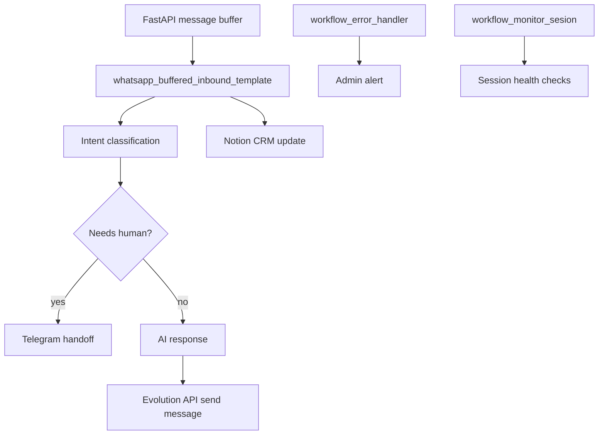

# n8n Workflows

This folder stores reusable n8n workflow exports from the previous WhatsApp responder project.

## Workflow Map

Current workflows:

- `workflow_agente_whatsapp.json` - inbound WhatsApp agent proof of concept with handoff
- `workflow_error_handler.json` - error alert workflow
- `workflow_monitor_sesion.json` - session monitor workflow
- `whatsapp_buffered_inbound_template.json` - new buffered inbound workflow template for messages coming from the FastAPI Redis buffer service

These files are context for future business automations. Before using them for a client:

- replace political-campaign language with client-specific business language
- add fresh n8n credentials after import
- configure Evolution API and n8n through `.env`
- test with a sandbox number first
- keep human handoff enabled

Do not store n8n credentials, QR sessions, WhatsApp session data, or production execution data in this repository.
