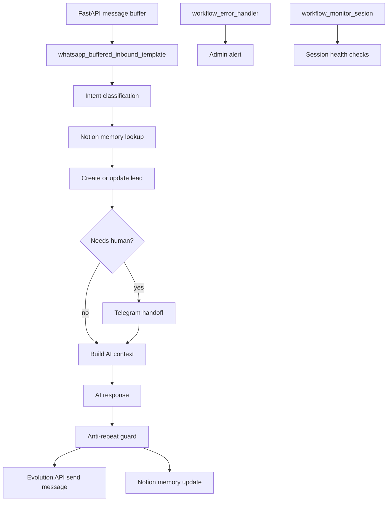

# n8n Workflows

This folder stores the reusable n8n workflow templates that power the WhatsApp lead-qualification system.

## Workflow Map

```mermaid
flowchart TD
    A[FastAPI message buffer] --> B[whatsapp_buffered_inbound_template]
    B --> C[Intent classification]
    C --> D[Notion memory lookup]
    D --> E[Create or update lead]
    E --> F{Needs human?}
    F -- yes --> G[Telegram handoff]
    F -- no --> H[Build AI context]
    G --> H
    H --> I[AI response]
    I --> J[Anti-repeat guard]
    J --> K[Evolution API send message]
    J --> L[Notion memory update]
    M[workflow_error_handler] --> N[Admin alert]
    O[workflow_monitor_sesion] --> P[Session health checks]
```

Current workflows:

- `whatsapp_buffered_inbound_template.json` - the main workflow: receives one combined payload from the FastAPI Redis buffer service, classifies intent, upserts the lead in Notion, hands off hot leads to Telegram, generates the WhatsApp reply, and updates conversation memory. AI calls work against Azure OpenAI or the Gemini API, selected with `AI_PROVIDER` (see `docs/n8n/whatsapp_buffered_inbound_workflow.md`).
- `workflow_error_handler.json` - Telegram alert for failed executions. Select it as the "Error Workflow" in the main workflow's settings after import.
- `workflow_monitor_sesion.json` - checks the Evolution API session every 10 minutes and alerts on Telegram when WhatsApp disconnects.
- `legacy/workflow_agente_whatsapp.json` - the original single-workflow proof of concept. Superseded by the buffer service plus the buffered template; kept only as historical context.

All templates read secrets and IDs through `$env.*` environment variables. Before using them for a client:

- adapt prompts and business language to the client
- add fresh n8n credentials after import (Telegram bot)
- configure Evolution API, AI provider, and Notion through `.env`
- test with a sandbox number first
- keep human handoff enabled

Do not store n8n credentials, QR sessions, WhatsApp session data, or production execution data in this repository.
Live exports from n8n can also include workflow IDs, credential names, Telegram chat IDs, calendar account IDs, and other operational metadata. Keep those local or sanitize them before committing; use `whatsapp_buffered_inbound_template.json` as the tracked template.
